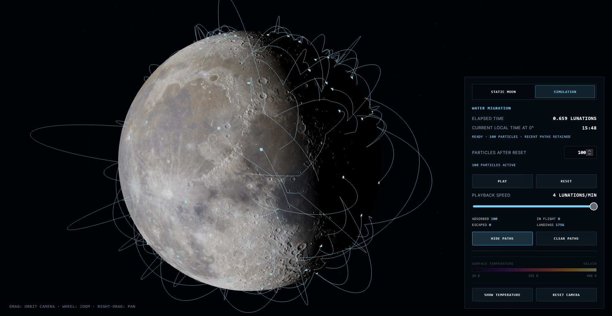

# Lunar Water Migration Simulation

An interactive Three.js visualization of lunar illumination, Diviner surface temperatures, and thermally driven water migration. Water molecules adsorb to the terrain, desorb probabilistically, follow ballistic trajectories under lunar gravity, and adsorb again when they land.



## Physical Model

- Surface temperatures are spatially and temporally interpolated from [Diviner snapshots](https://luna1.diviner.ucla.edu/~jpierre/diviner/level4_raster_data/).
- Desorption uses the rate and timestep survival probability as in Peschel et al. (2026).
- Adsorption energies follow the Schorghofer (2023) exponential fit with `E_p = 0.65 eV`, `W = 0.22 eV`, and a normalized upper truncation at `1.55 eV`.
- Launch velocities follow the Maxwell-Boltzmann flux distribution and are rotated by the local terrain normal.
- Flights use a two-second velocity-Verlet integration under three-dimensional central lunar gravity.

## Run Locally

Serve the repository over HTTP, then open the displayed URL:

```bash
python3 -m http.server 8000
```

Run the physics tests with:

```bash
npm test
```

## Project Structure

- `main.js`: application state, tabs, controls, and rendering loop.
- `water-simulation.js`: adsorption, desorption, launch sampling, and flight physics.
- `simulation-renderer.js`: particle markers and bounded latest-hop traces.
- `diviner.js`: Diviner data loading and temperature interpolation.
- `moon.js`: lunar terrain mesh, illumination, and thermal shader.
